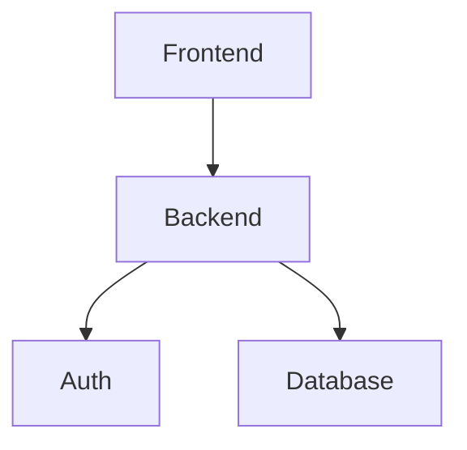

## Diretrizes para Diagramas

Quando diagramas forem necessários, eles devem ser escritos utilizando Mermaid.

O objetivo do diagrama é facilitar a compreensão da arquitetura, não substituir a explicação textual.

Todo diagrama deve ser acompanhado de uma breve descrição explicando seu propósito e os principais elementos representados.

---

### Princípios

Os diagramas devem seguir os seguintes princípios:

* Simplicidade acima de completude.
* Legibilidade acima de detalhamento.
* Um diagrama para cada objetivo.
* Pouco texto dentro dos elementos.
* Fluxos visuais claros.
* Evitar cruzamento excessivo de linhas.
* Evitar representar toda a arquitetura em um único diagrama.

O leitor deve conseguir compreender o diagrama em poucos segundos.

---

### Separação por Contexto

Não criar diagramas gigantes contendo todos os sistemas, fluxos e componentes.

Preferir múltiplos diagramas pequenos, cada um representando uma visão específica.

Exemplos:

* Contexto do sistema.
* Fluxo principal de negócio.
* Fluxo de integração.
* Fluxo assíncrono.
* Componentes internos.

---

### Diagrama de Contexto

Utilizar para demonstrar onde o sistema está inserido dentro do ecossistema.

Exemplo:


Boas práticas:

* Máximo de 5 a 8 elementos.
* Representar apenas relações relevantes.
* Não incluir tecnologias.

---

### Diagrama de Fluxo

Utilizar para demonstrar a jornada principal da informação.

Exemplo:


Boas práticas:

* Destacar apenas o fluxo principal.
* Evitar exceções e cenários alternativos.
* Não detalhar implementação interna.

---

### Diagrama de Integração

Utilizar para demonstrar comunicação entre sistemas.

Exemplo:


Boas práticas:

* Focar nas dependências.
* Demonstrar direção da comunicação.
* Omitir detalhes técnicos irrelevantes.

---

### Diagrama de Componentes

Utilizar quando houver necessidade de mostrar divisões internas relevantes.

Exemplo:



Boas práticas:

* Exibir apenas componentes significativos.
* Evitar classes, métodos ou diretórios.
* Não transformar o diagrama em documentação técnica.

---

### O que evitar

Evitar diagramas que:

* Possuam mais de 15 elementos.
* Possuam textos longos dentro dos blocos.
* Representem múltiplos contextos simultaneamente.
* Misturem arquitetura, implementação e operação.
* Exijam zoom para serem compreendidos.
* Sejam equivalentes a uma captura visual do código.

Exemplo de antipadrão:

```text
Frontend + API + Banco + Filas + Lambdas + Eventos +
Observabilidade + Deploy + CI/CD + Infraestrutura
em um único diagrama.
```

Nestes casos, dividir em múltiplos diagramas menores.

---

### Critério de qualidade

Um diagrama arquitetural é considerado adequado quando:

* Possui um único objetivo.
* Pode ser compreendido rapidamente.
* Possui poucos elementos.
* Possui baixo volume de texto.
* Complementa a documentação escrita.
* Facilita a compreensão sem exigir conhecimento prévio da solução.

Se o diagrama precisa de uma longa explicação para ser entendido, ele provavelmente está complexo demais e deve ser simplificado ou dividido.
