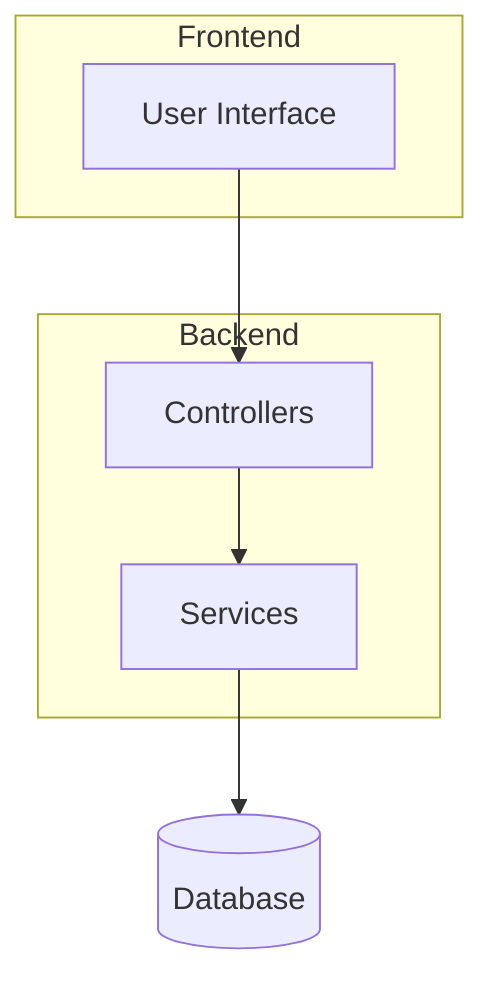
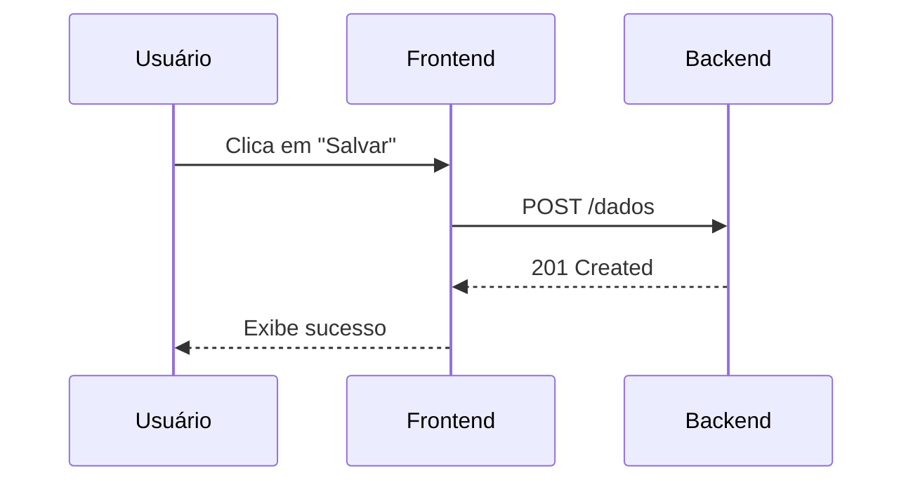

<!-- TEMPLATE: arquitetural -->
# Documentação Arquitetural

> Utilize apenas as seções relevantes para o projeto.
> Prefira múltiplos diagramas simples a poucos diagramas complexos.
> Diagramas devem ser feitos em Mermaid e sempre acompanhados de explicação textual.

---

# Visão Geral

## Objetivo
<!-- INICIO:OBJETIVO (OBRIGATÓRIO) -->
Descreva como o sistema está organizado em alto nível e suas premissas arquiteturais.
<!-- FIM:OBJETIVO -->

## Contexto
<!-- INICIO:CONTEXTO (OBRIGATÓRIO) -->
Explique brevemente onde o sistema se encaixa no ecossistema geral e quem interage com ele.
<!-- FIM:CONTEXTO -->

---

# Visão de Contexto

## Diagrama de Contexto
<!-- INICIO:DIAGRAMA_CONTEXTO (OBRIGATÓRIO) -->

### Explicação
Explique brevemente as interações ilustradas no diagrama de contexto acima.
<!-- FIM:DIAGRAMA_CONTEXTO -->

---

# Componentes de Alto Nível

## Principais Componentes
<!-- INICIO:COMPONENTES (OBRIGATÓRIO) -->
Liste os blocos principais da arquitetura e as responsabilidades gerais de cada um:
* **Frontend:** Interface com o usuário.
* **Backend:** Regras de negócio e API REST.
* **Database:** Banco relacional.
<!-- FIM:COMPONENTES -->

## Diagrama de Componentes
<!-- INICIO:DIAGRAMA_COMPONENTES (OBRIGATÓRIO) -->

<!-- FIM:DIAGRAMA_COMPONENTES -->

---

# Fluxos Arquiteturais

## Fluxo Principal
<!-- INICIO:FLUXO_PRINCIPAL (OBRIGATÓRIO) -->
Descreva o fluxo principal de dados ou execução do sistema:

<!-- FIM:FLUXO_PRINCIPAL -->

---

# Integrações

## Sistemas Externos
<!-- INICIO:INTEGRACOES (OPCIONAL) -->
| Sistema | Tipo de Integração | Finalidade |
| ------- | ------------------ | ---------- |
| [Ex: Gateway Pagamento] | [HTTPS / REST] | [Processamento de cobrança] |
<!-- FIM:INTEGRACOES -->

---

# Requisitos Arquiteturais
<!-- INICIO:REQUISITOS_ARQUITETURAIS (OPCIONAL) -->
Preencha apenas os requisitos não-funcionais que influenciam diretamente o desenho do sistema:
* **Disponibilidade:** [Ex: O sistema deve estar ativo 99.9% do tempo.]
* **Escalabilidade:** [Ex: Suportar aumento de requisições via escalonamento horizontal.]
<!-- FIM:REQUISITOS_ARQUITETURAIS -->

---

# Restrições Arquiteturais
<!-- INICIO:RESTRICOES (OPCIONAL) -->
Liste limitações impostas ao desenho do sistema:
* [Ex: Deve operar exclusivamente dentro da nuvem AWS.]
* [Ex: Uso obrigatório do banco de dados PostgreSQL.]
<!-- FIM:RESTRICOES -->

---

# Referências

## Documentação Relacionada
* [Documentação Funcional](./funcional.md)
* [Documentação Técnica](./tecnica.md)
* [Documentação Operacional](./operacional.md)
